# git_basico
Esto es un ejemplo de un proyecto simple y su control de versiones a través de git y github. Es una guía muy sencilla y es necesario tener en cuenta que existen otras maneras, algunas mucho más avanzadas y/o profesionales, pero es un buen punto de partida.

Para más info puedes consultar los sitios oficiales de [git](https://git-scm.com/) y [github](https://github.com/)

>A lo largo de este documento se detallan algunos comandos básicos, dependiendo del sistema operativo estos pueden ser diferentes. Cuando sea así, se detallará si son para **windows** o **ubuntu**, en este caso deberían ser válidos para todo S.O. base **Debian**, pero se se decidió expresarlo así porque no fue posible probarlo.  

# Que se necesita.

## 1 - Tener una cuenta de ``gitHub``.  
https://github.com/

## 2 Tener instalado `git` en nuestro sistema
Como instalar git en [ubuntu](https://github.com/ec4lab/ubuntu#instalar-git-en-ubuntu) o en [windows](https://github.com/ec4lab/windows#instalar-git-en-windows-11)

## 3 Tener instalado python en nuestro sistema
Como instalar python en [ubuntu](https://github.com/ec4lab/ubuntu#instalar-python-en-ubuntu) o en [windows](https://github.com/ec4lab/windows#instalar-python-en-windows-11)

## 3-Tener instalado `VSCode` en nuestro sistema
Como instalar VSCode en [ubuntu](https://github.com/ec4lab/ubuntu#instalar-vscode-en-ubuntu) o en [windows](https://github.com/ec4lab/windows#instalar-vscode-en-windows-11)

### Si se realiza la documentación en ``markdown``,
Es conveniente tener corrector, par esto se pueden instalar las extensiones `Code Spell Checker` y `Spanish - Code Spell Checker` en VSCode. 

Luego se debe agregar en [settings.json](https://github.com/ec4lab/ubuntu#personalizar-settingsjson):  
```json
"cSpell.language": "es,en" 
````
[Aquí](https://github.com/ec4lab/markdown) un breve tutorial de como dar formato a un texto en markdown


# Flujo de trabajo:

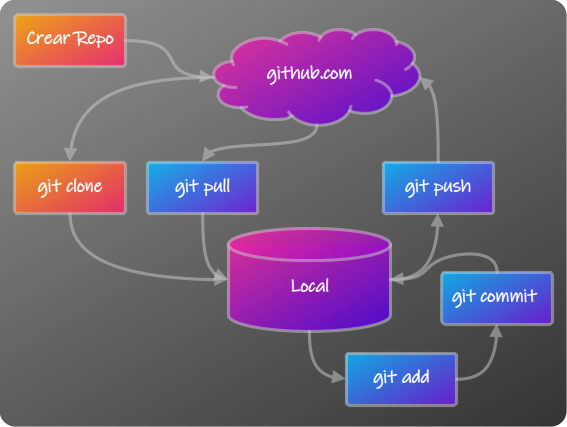 

1) Crear Repositorio (1 sola vez), en la nube (github.com)
2) Clonar el repositorio desde la nube a local (1 sola vez) con `git clone`
3) Trabajar en local modificando/agregado/eliminando archivos.
4) Añadir los archivos al stage (tracking) con `git add` 
5) Aplicar `git commit` para crear una "foto" de los archivos en el stage
6) 'git push' para actualizar el repositorio en la nube
7) Al trabajar de manera colaborativa, el repositorio online se va a ir actualizando cada vez que alguien realice un `git push`, para asegurar que la copia local sea la actual, realizamos un `git pull` antes de comenzar a trabajar.


## 1- Crear un nuevo repositorio en en [github.com](https://github.com)  

Navegar hasta el Dashboard y hacer click en  

Elegir un  nombre: git_básico
Colocar una descripción (opcional)

Y luego se puede elegir si se crean los siguientes archivos:

+ **Add README**, se recomienda, en este archivo se escribirá la documentación.
+ **.gitignore**, se puede elegir de acuerdo al lenguaje de programación que se a utilizar, o agregar después en base a plantillas o creando uno propio.  
+ **Licencia**, de acuerdo al tipo de proyecto en el que se esté trabajando, en este caso MIT, se pueden ver más detalles sobre licencias [aquí](https://docs.github.com/es/repositories/managing-your-repositorys-settings-and-features/customizing-your-repository/licensing-a-repository)

Finalmente se crea el repositorio con  

Ya en la página del repositorio, se muestra un listado con todos los archivos y carpetas que contiene  y una vista previa del README.md (debe tener ese nombre para tener una vista previa automática).


## 2- Clonar el repositorio en VSCode

En el repositorio online presionar el botón , en la pestaña HTTPS copiar la URL, en este caso:  
https://github.com/ec4lab/git_basico.git

Antes de clonarlo localmente,se debe que decidir la ubicación repositorio, si por ejemplo se establece la estructura:  
```
/ec4lab
├── git_basico/
│   ├── .venv/
│   ├── .gitignore
│   ├── .privado/
│   ├── imagenes/
│   ├── LICENSE
│   ├── main.py
│   └── README.md
├── repo_1/
│   └── ...
└── repo_2/
    └── ...
```
Suponiendo que ya existe la carpeta raíz `ec4lab`, se debe navegar hasta la misma en el terminal de VSCode: *Terminal -> Nuevo Terminal*  
En la aparte de abajo aparecerá un terminal y la ruta actual, se debe navegar hasta la carpeta raíz:
```bash
cd ec4lab/
```
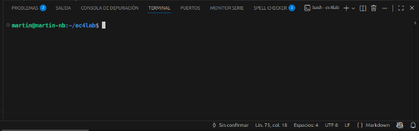 

> Nota: **No** crear la carpeta `git_basico`, porque de lo contrario al clonar va a quedar:`ec4lab/git_basico/git_basico`. el comando `git clone` ya trae la carpeta.

En la carpeta raíz se clona el repositorio ejecutando:
```bash
git clone https://github.com/ec4lab/git_basico.git
```
Esto va a traer todo el repositorio tal cual está en la web, ahora ya es posible trabajar con él:

Primero: ingresar a la carpeta del repositorio
```bash
cd git_basico
```
y ahora ya es posible a editar/agregar archivos.


## 3- Archivos Locales.

Antes de empezar a crear/editar archivos del proyecto se debe establecer la estructura, con algunos archivos genéricos:
+ .gitignore
+ LICENCE

## .gitignore
Si no fue creado en el repositorio web, es posible agregarlo manualmente, puedes crearlo desde el mismo terminal.
```bash
touch .gitignore # en Ubuntu
``
```powershell
New-Item .gitignore # en Windows
```
También es posible desde el explorador, creando un nuevo block de notas y guardándolo como `.gitignore`, es muy importante el punto al inicio (para que sea un archivo oculto) y que no contenga extensión.
En el explorador de VSCode aparecerá como: 
  

Este archivo contiene los nombres (o patrones) de archivo y/o carpetas que git va a ignorar a la hora de actualizar el repositorio, es decir solo quedarán en la copia local del repositorio y no habrá ni copia ni historial de los mismos en el repositorio web.
Si el archivo fue creado junto con el repositorio ya tendrá contenido de acuerdo al lenguaje que se haya elegido, y es posible editarlo. Si fue creado localmente se debe agregar el contenido, algunas líneas generales pueden ser:

```bash
# Entorno virtual,
.venv/

# Archivos temporales de Python
__pycache__/
*.py[cod]
*.pyo

# Archivos de sistema
.DS_Store
Thumbs.db

# Archivos de VSCode
.vscode/

# Archivos por extensión
#*.xlsx # Todos los .xlsx
#*.csv  # Todos los .csv
#*.jpg  # Todos los .jpg

# Archivos específicos
archivo.txt
secrets.yaml

# Carpetas completas
#Carpeta_1/ # Carpeta 1 y todo su contendido

# Carpetas ocultas completas
.privado/ # Carpeta privado y todo su contendido

```

## Licencia
Al igual que `.gitignore`,Si no fue creado con el repositorio web, es posible agregarlo, un archivo te texto plano sin extensión con el nombre: `LICENCE`, [aquí](https://docs.github.com/es/repositories/managing-your-repositorys-settings-and-features/customizing-your-repository/licensing-a-repository) una lista de las posibles licencias que se pueden elegir.

No hay obligación de elegir una, sin embargo, sin una licencia, se aplican las leyes de derecho de autor predeterminadas, lo que implica que se conservan todos los derechos del código fuente, y nadie puede reproducir, distribuir o crear trabajos a partir de este trabajo. Si, en cambio, se está creando un proyecto de código abierto, se alienta fuertemente a que se incluya una licencia de código abierto.

## Código y archivos
Hasta aquí se a creado el esquema básico, y se podría considerar que son genéricos a la mayoría de los proyectos, es hora de trabajar en los archivos particulares, en este caso se va a realizar un ejemplo sencillo en python.

Desde el terminal o el explorador, se crea el archivo `main.py`, es posible colocar cualquier nombre, pero es una buena práctica nombrar el archivo principal como main.
El contenido de este archivo será:

```python
#main.py - Ejemplo sencillo para probar git y github
__version__= "0.1.0"
# V0.1.0
# Versión inicial

import requests

a = 2
b = 3
print(f'a + b es igual a: {a+b}')

print(f'Versión de request: {requests.__version__}')
print(f'Todo OK en la versión 0.1.0')
```
## Entornos virtuales
Al momento de programar es conveniente hacerlo dentro de entornos virtuales, un entorno virtual es una carpeta que contiene una instalación aislada de Python y sus paquetes y evita así, conflictos entre dependencias de distintos proyectos. Podría tomar cualquier nombre pero es una buen práctica llamarlo `.venv`

Se puede crear directamente desde el terminal, hay que asegurase de estar dentro de la carpeta del proyecto:
```bash
cd ec4lab/git_basico/
```
y para crear el entorno virtual ejecutar:

```Bash
python3 -m venv .venv # En Ubuntu  
```
```Powershell
python -m venv .venv # En Windows
```
se vera en el explorador el entorno virtual creado:    
Luego es necesario activar el entorno virtual:
```Bash
source .venv/bin/activate # En Ubuntu 
```
```Powershell
.venv\Scripts\Activate # En Windows
```

> En Windows es posible que la primera vez que se quiera activar el venv de el error:  
> + CategoryInfo : SecurityError: (:) [], PSSecurityException
> + FullyQualifiedErrorId : UnauthorizedAccess

Para solucionarlo, se debe abrir una ventana de `powershell`como administrador y ejecutar:
```powershell
Set-ExecutionPolicy RemoteSigned -Scope CurrentUser # Si pregunta, elegir [Si]
```

Cuando esté activado el entorno virtual, la ventana del terminal lo indicará poniendo `(.venv)` al principio de la línea de comando:

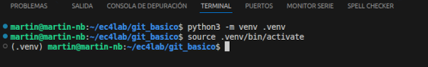   

## Seleccionar interprete
Al crear un entorno virtual, se ha creado una versión aislada de python en donde es posible instalar librerías y paquetes de manera local sin afectar la instalación global. Para asegurar de estar utilizando esta versión aislada, se debe corroborar que VSCode efectivamente esté utilizando esta versión.

Con `main.py` abierto presionar `ctrl`+`shift`+`p`, en la barra de búsqueda escribir `seleccionar intérprete`se abrirá una pestaña en la parte superior de la ventana donde se podrá comprobar el intérprete seleccionado actualmente:

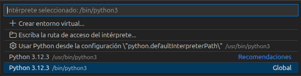  

En este caso está seleccionado el interprete global, entonces se debe cambiar haciendo click en `Escriba la ruta de acceso del intérprete...`
y navegando hasta ubicación del interprete del entorno virtual creado.  
Volviendo a presionar `ctrl`+`shift`+`p`, comprobar que el interprete seleccionado sea el correcto:

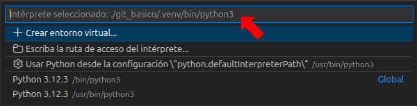  

En **ubuntu** por por general las rutas son:
```bash
/bin/python3 # Para el intérprete global
/NOMBRE_DEL_PROYECTO/.venv/bin/python3 # Para el intérprete del venv
```
En **windows** por por general las rutas son:
```powershell
~\AppData\Local\Programas\Python\Python3x\python.exe # Para el intérprete global
\NOMBRE_DEL_PROYECTO\.venv\Scripts\python.exe # Para el intérprete del venv
```

## Instalar librerías
Con el entorno virtual creado y activado y el intérprete correcto seleccionado ya se puede ejecutar el código, como el intérprete es un "clon" de la versión de python instalada, este ya contiene las librerías de la biblioteca estándar como por ejemplo `os` `sys` `datetime` `math` `Tkinter`, etc. Pero es muy probable que el código requiera la instalación de otras librerías.

En ese ejemplo, se necesita `requests, entonces simplemente se instala:
```bash
pip install requests # para instalar la última versión
pip install requests==2.32.5 # para instalar una versión específica
pip install --upgrade requests # para actualizar la versión instalada
```
También es posible instalar varias librerías al mismo tiempo:
```bash
pip install requests numpy plotly matplotlib Tkinter
```

Una vez que ya estén instaladas todos las librerías necesarias, se crea el archivo `requirements.txt`, este archivo será parte del repositorio y se utilizará cuando sea clonado en otras pc, incluso en otros sistemas operativos, asegurando instalar las versiones específicas con las que fue generado el código original.
Para crear el archivo por primera vez, o actualizar el existente:
```bash
pip freeze > requirements.txt
```
Para instalar todas las librerías detalladas en `requirements.txt` (repo clonado):
```bash
pip install -r requirements.txt
```
### Otros comandos relacionados con librerías

```bash
pip show requests # Verificar la versión de un paquete instalado
pip list # Listar las librerías instaladas
pip uninstall requests # Eliminar librería instalado
pip uninstall -r requirements.txt -y # Desinstalar todas las librerías
```

## 4- Añadir archivos al stage (tracking)
En este punto el proyecto ya está operativo, con las librerías necesarias instaladas ya es posible ejecutar el código

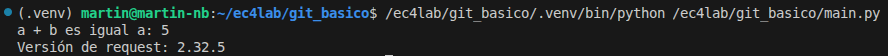  

En el explorador de archivos de VSCode se pueden ver todos los archivos del repositorio local:

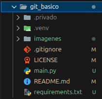  

Al lado de cada archivo y/o carpeta se puede ver una referencia del estado:  
- Las carpetas `.privado` y `.venv` no tienen marcas porque fueron listadas en `.gitignore`y por lo tanto no son tenidos en cuenta.
- La `M` de los archivos `gitignore` `LICENSE` `README.md`indica que los archivos fueron modificados y que son diferentes respecto a los archivos en el repositorio web.
- La `U` de los archivos `main.py` y `requirements.txt`, significa "untracked", e indica que git aún no registra estos archivos, es decir fueron creados recientemente.  
- El punto al lado de la carpeta `imagenes` indica que dentro contiene archivos y/o carpetas que fueron creados o modificados.

Toda esta información se puede obtener ejecutando en el terminal:
```bash
git status
```
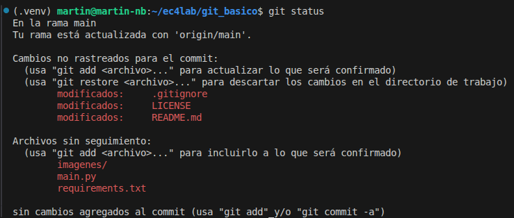  

Para que git agregue al `stage` los archivos `M` y `U` se ejecuta:
```bash
git add .
```
Ahora todos los archivos modificados y no trackeados están el el stage.

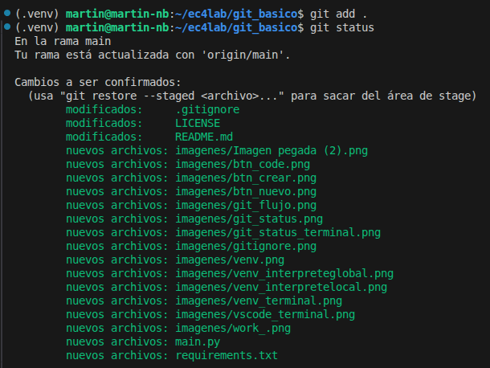  

### Consideraciones del comando `git add`
Tener en cuenta que `git add .` agrega todos los archivos y carpetas en el directorio actual de trabajo, si ejecutamos en el directorio raíz efectivamente cargará todos los archivos y carpetas, pero si por ejemplo se ejecuta dentro de la carpeta `imagenes`, solo agregará los archivos y capetas dentro de esta.
Para agregar todos los archivos, sin importar el directorio donde se ejecuta el comando se debe realizar:
```bash
git add --all
git add -A  # Versión corta
```
Es posible que en el desarrollo del proyecto no sea necesario agregar al stage todos los archivos, es posible agregar de a uno (varios) indicando el nombre luego del git add`
```bash
git add main.py
```
Se puede revertir (quitar los archivos del stage) con:
```bash
git reset
```
o quitar solo un archivo con:
```bash
git restore --staged LICENSE
```

## 5- git commit
Agregar archivos al stage, no significa que ya son parte del repositorio sino que es un paso intermedio, para agregarlos definitivamente al historial de versiones se debe aplicar un commit con el comando.
```bash
git commit -m "Versión 0.1.0"
```
Esto genera un snapshot del estado del repositorio actual, pero solo los archivos que se encuentran en el `stage`, cualquier otro archivo no agregado o afectado por `gitignore` no se guardará.  
Las notas del commit (texto entre comillas `""` es una breve referencia a las modificaciones realizadas)
En este momento la `foto`del proyecto está almacenada localmente para actualizar el repositorio web se debe hacer un push al servidor.


## 6- git push
```bash
git push
```
Este comando enviará todos los archivos del `commit` al servidor actualizando la información en el, al mismo tiempo que genera una etiqueta para luego poder ver el historial de versiones.

Si es la primera vez que ejecutas este comando, se solicitará ingresar usuario y contraseña de GitHub.

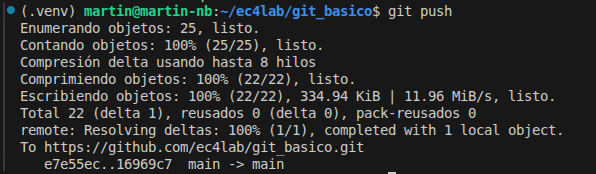  

en este punto el repositorio web está actualizado según el último commit

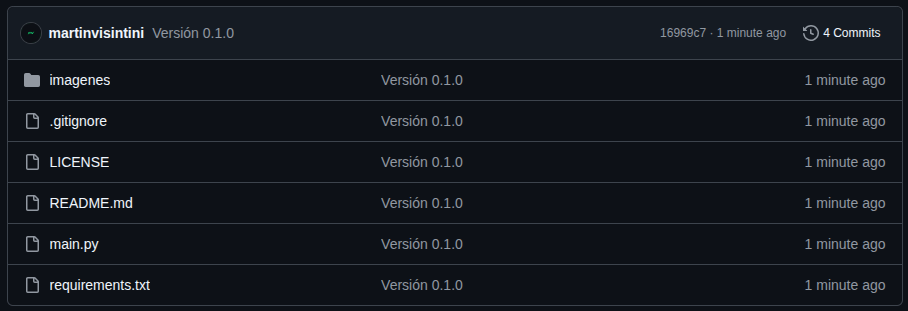

## 7- Flujo de trabajo

De ahora en adelante el flujo de trabajo (siempre que no se deba volver a versiones anteriores) es similar a lo ya realizado:

- [modificar](#3--archivos-locales) archivos
- git [add](#4--añadir-archivos-al-stage-tracking) .
- git [commit](#5--git-commit) - m "Modificaciones"
- git [push](#6--git-push)

## 8- Clonar el proyecto en otra PC o usuario
Los primeros pasos son similares a los ya vistos:

- [Clonar](#2--clonar-el-repositorio-en-vscode) el proyecto(solo primera vez)
- [Navegar](#2--clonar-el-repositorio-en-vscode) a la carpeta del proyecto
- [Crear](#entornos-virtuales) entorno virtual
- [Activar](#entornos-virtuales) el entorno virtual
- [Seleccionar](#seleccionar-interprete) interprete
- [instalar](#instalar-librerías) librerías

Verificar si la copia local está actualizada
```bash
git fetch
```
Este comando trae los cambios en el servidor remoto pero no reemplaza archivos locales, de esta manera se puede verificar si los datos locales están actualizados o no.

Verificar actualizaciones
```bash
git status
```
Posibles salidas:
```
Your branch is up to date with 'origin/main'. → Repositorio Remoto y local sincronizados
Your branch is behind 'origin/main' by X commits. → Faltan cambios
```
para actualizar la copia local:
```bash
git pull
```
Luego se continúa con el flujo de trabajo normal
- [modificar](#3--archivos-locales) archivos
- git [add](#4--añadir-archivos-al-stage-tracking) .
- git [commit](#5--git-commit) - m "Modificaciones"
- git [push](#6--git-push)

# Licencia
Este proyecto está licenciado bajo la Licencia MIT.
Está permitido el uso, copia, modificaciones y distribución del software libremente, siempre que se incluya el aviso de derechos de autor original.  

Para más información, consultar el archivo [LICENSE](LICENSE).